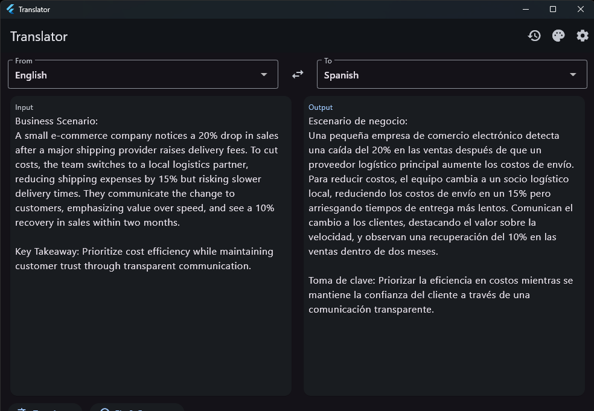
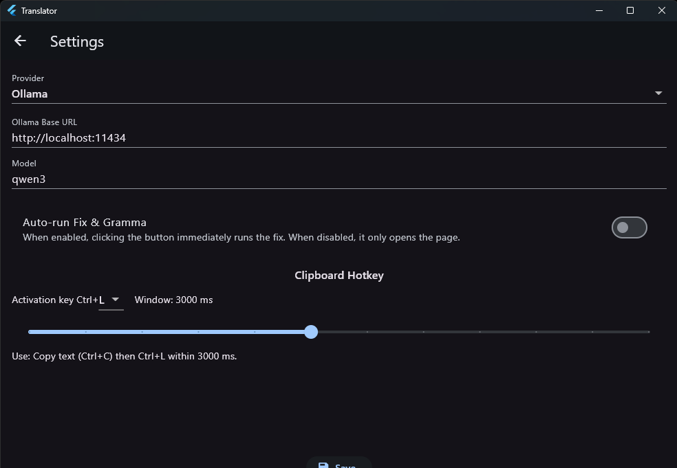
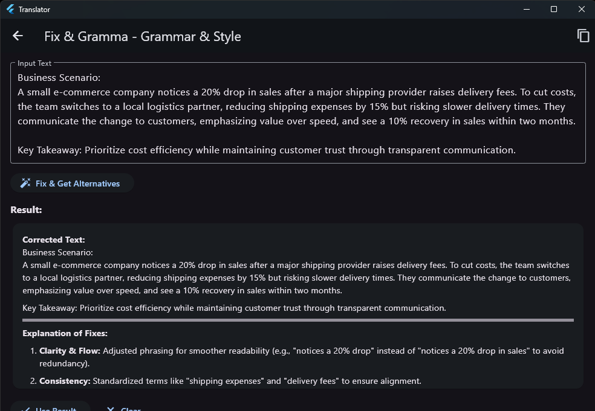

# Translator App

Cross‑platform (Flutter) translation UI with pluggable backends. Backends: local Ollama LLM (prompt engineered) and Azure Cognitive Services Translator.

## Features (current)
* Text translation with selectable source (or auto) and target languages.
* Persistent settings for provider configuration (Ollama base/model or Azure endpoint/key/region).
* Simple, responsive UI for desktop & mobile + history + theme switching.
* Abstraction layer (`TranslationService`) to add more providers later (e.g. DeepL, OpenAI, Gemini).

## Screenshots
The images below show the main desktop workflow: translation, provider configuration, and grammar improvement.

### Translator Screen
The main view lets you select source and target languages, paste or type content, and review the translated output side by side.



### Settings Screen
The settings page is used to switch providers, configure the Ollama connection, and adjust the clipboard hotkey behavior.



### Fix & Gramma Screen
The Fix & Gramma page improves the original text, explains the corrections, and provides a cleaned-up result ready to reuse.



## Planned / Easy Extensions
* Streaming translation output.
* Model auto‑detection & caching model list.
* Multi‑segment / document translation.
* Offline queue & history.
* Glossary / custom dictionary.

## Install from GitHub
You can use the project directly from GitHub in two ways: clone the source code to run it locally, or download a packaged Windows build from GitHub Releases if one is available.

### Option 1: Clone and Run from Source
Use this option if you want to develop, test, or build the app yourself.

```
git clone https://github.com/zahasoftware/translator_app.git
cd translator_app
flutter pub get
flutter run -d windows
```

Requirements:
1. Git installed.
2. Flutter with Windows desktop support enabled.
3. Visual Studio with the Desktop development with C++ workload.

If you already cloned the repository before it was renamed, update the remote URL:

```
git remote set-url origin https://github.com/zahasoftware/translator_app.git
git remote -v
```

### Option 2: Download a Windows Build from GitHub Releases
Use this option if you only want to run the app without building it locally.

1. Open the Releases page: https://github.com/zahasoftware/translator_app/releases
2. Download the latest Windows release asset, usually a `.zip` package.
3. Extract the archive to a local folder.
4. Open the extracted folder and run `translator_app.exe`.

Important: if the release contains a `Release` folder, keep all files together. Do not move only the `.exe`, because the application also needs the bundled DLLs and Flutter data files.

## Run the App
Ensure you have Flutter installed.

```
flutter pub get
flutter run -d windows   # or another device id
```

## Windows Release Build
Validated on this project with:

```
flutter analyze
flutter test
flutter build windows --release
```

### Prerequisites
1. Flutter installed with Windows desktop support.
2. Visual Studio with the Desktop development with C++ workload.
3. Run `flutter doctor` and confirm there are no Windows toolchain errors.

### Generate the Release
From the project root:

```
flutter clean
flutter pub get
flutter analyze
flutter test
flutter build windows --release
```

### Output
The release files are generated in:

```
build/windows/x64/runner/Release/
```

Main executable:

```
build/windows/x64/runner/Release/translator_app.exe
```

Important: distribute the entire `Release` folder, not only the `.exe`, because Flutter desktop apps depend on the accompanying DLLs and data files.

### Verify the Release Locally
Run the generated executable from the `Release` folder:

```
build\\windows\\x64\\runner\\Release\\translator_app.exe
```

Or from PowerShell:

```
./build/windows/x64/runner/Release/translator_app.exe
```

### Optional Packaging
If you want to share the app manually, compress the full `build/windows/x64/runner/Release/` directory into a `.zip` file and distribute that archive.

## Using Ollama
1. Install Ollama: https://ollama.com
2. Start Ollama server (usually auto, default base URL http://localhost:11434).
3. Pull a model suited for translation (examples):
	 ```
	 ollama pull llama3
	 ollama pull mistral
	 ```
4. In the app Settings set Base URL (if different) and the model name (e.g. `llama3`).
5. Translate.

## Using Azure Translator
1. Create a Translator resource in Azure Portal.
2. Copy Endpoint (e.g. https://YOUR_RESOURCE.cognitiveservices.azure.com), Key, and Region (often the region name or "global").
3. Open Settings -> choose Provider: Azure Translator.
4. Enter the values and Save.
5. Translate.

## Add Another Provider
Implement `TranslationService` and register via a provider/factory (future: dynamic selection UI).

## Code Structure
```
lib/
	core/api_client.dart
	features/translation/
		translation_types.dart
		translation_service.dart
		translation_provider.dart
		ollama_translation_service.dart
	main.dart
```

## License
Private / Unlicensed (adjust as needed).
